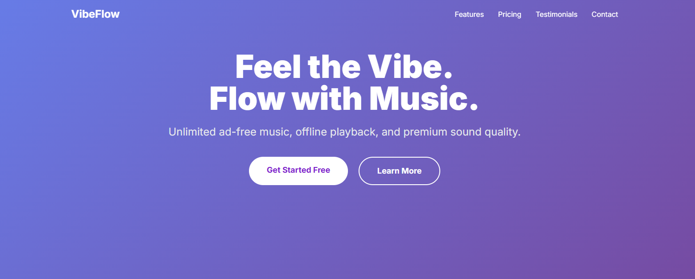
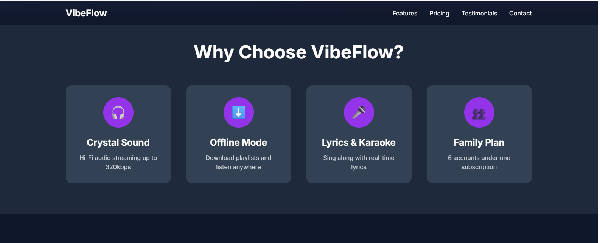
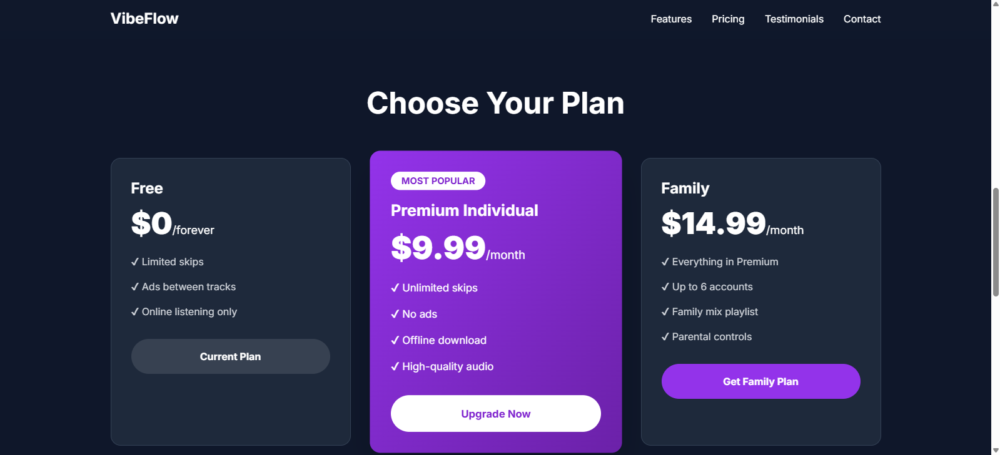
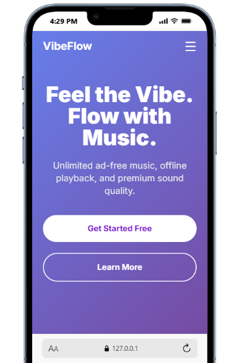
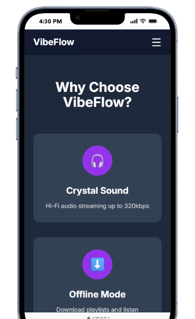
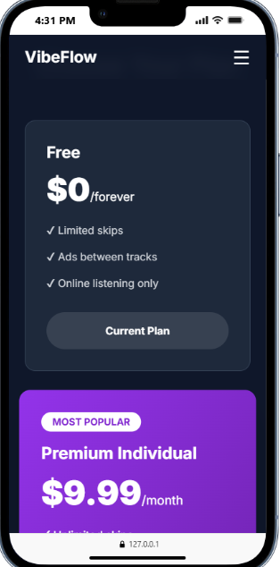

# VibeFlow - Music Streaming Landing Page

**Student:** But SeavThong
**Course:** FullStack Webdevelopment !

## Live Demo

https://github.com/ButSeavThong/full-stack-webdevelopment-assignment1.git

## Screenshots

## Features Implemented

- Fully responsive (320px → desktop)
- Sticky navbar with scroll background change
- Working mobile hamburger menu
- Hero with gradient & dual CTAs
- CSS Grid in "Why VibeFlow" section
- Flexbox pricing cards
- CSS + JS testimonial carousel with controls
- Smooth scrolling
- Hover/active states on all buttons
- All images < 200 KB

## Technologies Used

- HTML5
- CSS3 (Flexbox + Grid)
- Vanilla JavaScript
- Tailwind CSS via CDN (allowed per assignment)

## Credits

- Hero background: Photo by Milad Fakurian on Unsplash  
  https://unsplash.com/photos/person-using-macbook-pro-on-table-3ljj-m3hZUI
- Avatar 1: Photo by But SeavThong
- Avatar 2: Photo by Andrea Piacquadio on Pexels  
  https://www.pexels.com/photo/2379004/
- Avatar 3: Photo by LinkedIn Sales Solutions on Pexels  
  https://www.pexels.com/photo/91227/

## How to Run Locally

1. Clone the repo
2. Open `index.html` in browser
3. Or use Live Server in VS Code
